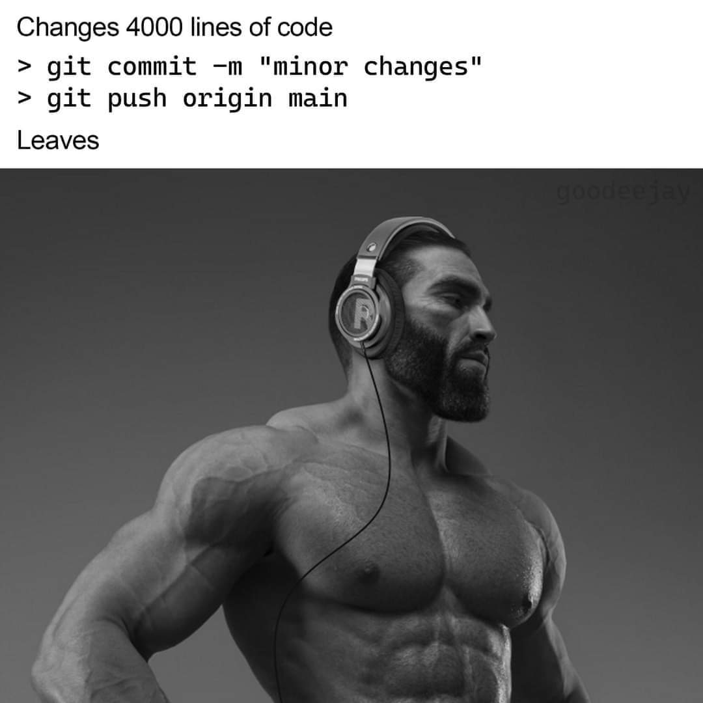

- 👋 Hi, I’m @Harmeet
<h2>Hey! 👋</h2>

 

<!-- code in ends-->
<h2>👀 Stats</h2>
 
<!--  -->

   
 

  
 <h2 align="center">🦊 🍥 ⛩️ 🍥 🍜 🦊</h2>
 

    
 

 
  

    <h2>My Github Activity</h2>
  And here's a graph for people who like graphs:

  

    
  

